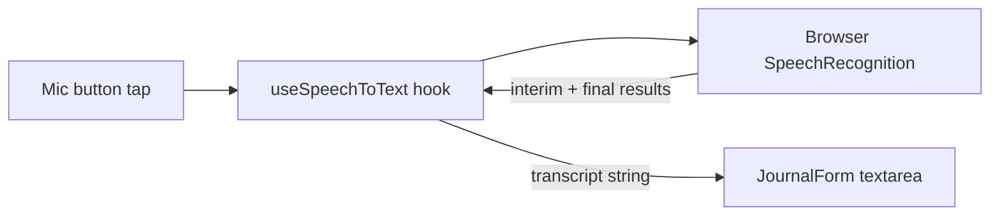

# Audio Speech-to-Text for Situation Field

## Approach

Use the **Web Speech API** (`SpeechRecognition` / `webkitSpeechRecognition`) which is free, requires zero backend, and works well on Chrome, Edge, and Android browsers. The transcribed text is streamed into the "O que aconteceu?" textarea in real time as the user speaks.

### Compatibility note
- Works natively on Chrome (desktop + Android), Edge, and Samsung Internet.
- Safari has partial support (may require user gesture each time).
- Firefox does not support it -- a toast will inform the user.

---

## Architecture



---

## Files Changed

### 1. New hook: `src/hooks/useSpeechToText.js`

Custom hook encapsulating the Web Speech API lifecycle:

```javascript
export function useSpeechToText({ lang = 'pt-BR', onResult, onError })
```

- Returns `{ isListening, start, stop, supported }`
- Sets `lang` to `pt-BR` for Portuguese recognition
- `continuous: true` + `interimResults: true` for real-time streaming
- Calls `onResult(transcript)` with each final result chunk
- Calls `onError(message)` on failure or unsupported browser
- Auto-stops after silence (browser default ~5s) or manual `stop()`

### 2. Updated: [src/components/JournalForm.jsx](src/components/JournalForm.jsx)

- Import `useSpeechToText` hook and `Mic` / `MicOff` icons from Lucide
- Add a mic toggle button inside the situation `form-group`, positioned to the right of the textarea
- On tap: starts listening; textarea receives real-time transcript appended to existing text
- On second tap (or auto-stop): stops listening
- Visual feedback: mic button pulses red while recording, idle state is muted
- If browser doesn't support it, hide the button entirely (graceful degradation)

Relevant insertion point -- after the textarea on line 56:

```jsx
{speechSupported && (
  <button type="button" className="mic-btn ..." onClick={toggleMic}>
    {isListening ? <MicOff /> : <Mic />}
  </button>
)}
```

### 3. Updated: [src/App.css](src/App.css)

New styles:
- `.mic-btn` -- circular button, positioned inside the textarea's form-group
- `.mic-btn--recording` -- red pulse animation while actively listening
- `.textarea-with-mic` -- wrapper to position the mic button relative to the textarea

---

## UX Details

- The mic button appears as a small circle to the right of the "O que aconteceu?" label
- While recording: button turns red with a soft pulse, and a small "Ouvindo..." indicator appears
- Transcribed text is **appended** (not replaced) so the user can dictate multiple times
- If the user typed something already, the transcription adds after a space
- Unsupported browser: button is hidden, no error shown
- Permission denied: toast with "Permita o acesso ao microfone nas configuracoes do navegador"
