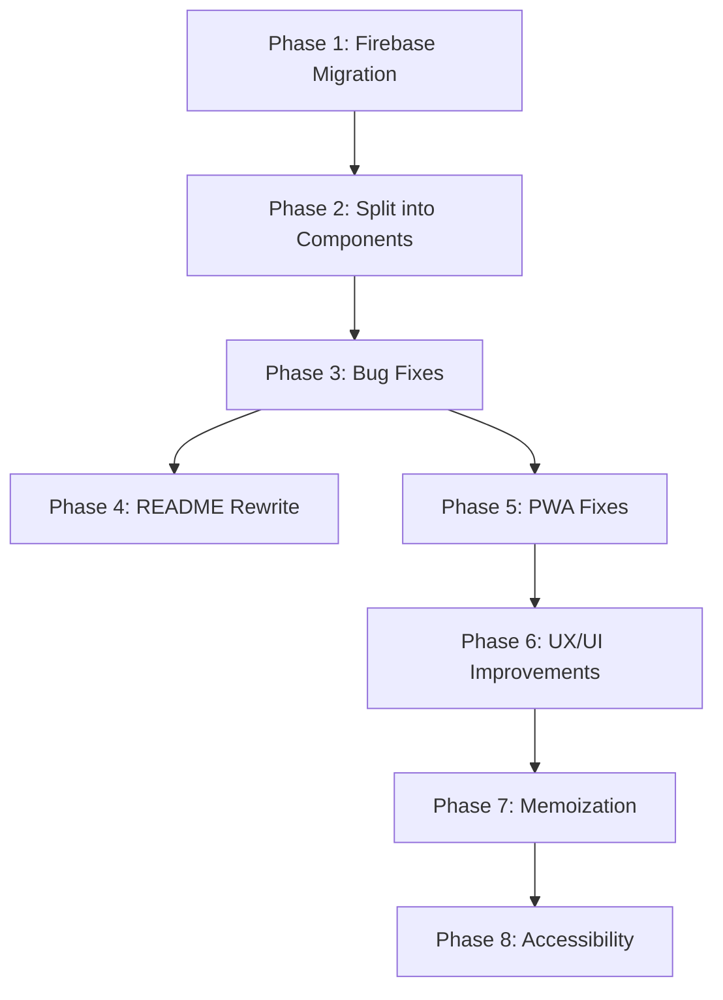

# MindLog Full Overhaul

## Phase 1: Firebase Migration

Replace Supabase with Firebase (Auth + Firestore) across the project.

### 1a. Dependencies and config

- Remove `@supabase/supabase-js` from [package.json](package.json)
- Install `firebase`
- Create `.env` at project root with `VITE_FIREBASE_*` variables (user must fill in from Firebase Console)
- Add `.env` to `.gitignore`
- Create [src/lib/firebase.js](src/lib/firebase.js) exporting `auth` and `db`, with `enableIndexedDbPersistence(db)` for offline support

### 1b. Rewrite all Supabase calls in App.jsx

Every Supabase touchpoint maps to a Firebase equivalent:

- **Auth listener** (`supabase.auth.getSession` + `onAuthStateChange`) becomes `onAuthStateChanged(auth, ...)`
- **Sign up** (`supabase.auth.signUp`) becomes `createUserWithEmailAndPassword(auth, email, password)`
- **Sign in** (`supabase.auth.signInWithPassword`) becomes `signInWithEmailAndPassword(auth, email, password)`
- **Sign out** (`supabase.auth.signOut`) becomes `signOut(auth)`
- **Fetch entries** (`supabase.from('entries').select(...)`) becomes a realtime `onSnapshot` listener on a Firestore query, removing the need for manual `fetchEntries()` calls
- **Insert entry** (`supabase.from('entries').insert(...)`) becomes `addDoc(collection(db, 'entries'), ...)`
- **Delete entry** (`supabase.from('entries').delete().eq(...)`) becomes `deleteDoc(doc(db, 'entries', id))`
- **User ID**: all `user.id` references become `user.uid`

---

## Phase 2: Architecture and Code Structure

Split the monolithic [src/App.jsx](src/App.jsx) (368 lines) into focused components and hooks.

### New file structure

```
src/
  lib/
    firebase.js          (Firebase client + offline persistence)
  hooks/
    useAuth.js           (auth state, login, register, logout)
    useEntries.js        (realtime listener, add, delete entries)
  components/
    LoginForm.jsx        (auth form - lines 188-220 of current App.jsx)
    BottomNav.jsx         (bottom navigation - lines 224-233)
    Header.jsx           (logo + welcome - lines 235-241)
    MoodChart.jsx        (doughnut chart - lines 272-286)
    JournalForm.jsx      (entry form - lines 288-312)
    MoodCalendar.jsx     (calendar card - lines 314-327)
    SearchBar.jsx        (search + filter chips - lines 329-343)
    EntryList.jsx        (entries list - lines 345-362)
    ProfileView.jsx      (profile section - lines 243-269)
  constants/
    moods.js             (MOOD_COLORS, MOOD_LABELS)
  App.jsx               (thin shell: routing between views, composes components)
  App.css                (unchanged, or split per component later)
  main.jsx              (unchanged)
```

### Custom hooks

**`useAuth`** encapsulates:
- `user`, `loading` state
- `login(email, password)`, `register(email, password)`, `logout()`
- `onAuthStateChanged` listener setup/teardown

**`useEntries`** encapsulates:
- `entries`, `loading` state
- Firestore `onSnapshot` listener (auto-subscribes when user is set, unsubscribes on cleanup)
- `addEntry(formData, dateType, customDate)`
- `deleteEntry(id)`
- `exportPDF(entries, userName)`

---

## Phase 3: Bug and Logic Fixes

### 3a. Calendar month navigation mutation (lines 316-318)

Current code mutates the Date object in place. Replace with:

```javascript
const prevMonth = () =>
  setCurrentMonth(new Date(currentMonth.getFullYear(), currentMonth.getMonth() - 1, 1));

const nextMonth = () =>
  setCurrentMonth(new Date(currentMonth.getFullYear(), currentMonth.getMonth() + 1, 1));
```

### 3b. Duplicate React keys for calendar day labels (line 321)

Keep the Brazilian weekday letters (`D, S, T, Q, Q, S, S`) but fix the key warning by using the index:

```javascript
{['D', 'S', 'T', 'Q', 'Q', 'S', 'S'].map((d, i) => (
  <div key={i} className="calendar-day-label">{d}</div>
))}
```

### 3c. Fragile date matching in `getDayColor` (lines 172-176)

Replace locale-dependent `toLocaleDateString()` comparison with ISO date string (`YYYY-MM-DD`) comparison:

```javascript
const getDayColor = (day) => {
  const target = `${currentMonth.getFullYear()}-${String(currentMonth.getMonth()+1).padStart(2,'0')}-${String(day).padStart(2,'0')}`;
  const entry = entryDateMap.get(target);
  return entry ? MOOD_COLORS[entry.mood] : 'rgba(255,255,255,0.05)';
};
```

### 3d. Silent error on fetchEntries failure

The `onSnapshot` listener accepts an error callback. Add proper error handling that sets an error state for the user to see.

### 3e. Remove misleading password display in profile (lines 258-264)

Remove the "Senha Cadastrada" section entirely. The `password` state variable only holds what was typed during login and is empty after refresh. Replace with a "Alterar Senha" button that triggers Firebase `sendPasswordResetEmail`.

---

## Phase 4: README Rewrite

Rewrite [README.md](README.md) to reflect the actual stack:

- React 18 + Vite (not vanilla JS)
- Firebase Auth + Firestore (not localStorage)
- Offline support via Firestore persistence
- Remove claims about features not yet implemented (trigger insights)
- Update tech stack list
- Update installation instructions

---

## Phase 5: PWA Fixes

### 5a. Create `public/manifest.json`

```json
{
  "name": "MindLog",
  "short_name": "MindLog",
  "start_url": "/",
  "display": "standalone",
  "background_color": "#09090b",
  "theme_color": "#09090b",
  "icons": [
    { "src": "/icon-192.png", "sizes": "192x192", "type": "image/png" },
    { "src": "/icon-512.png", "sizes": "512x512", "type": "image/png" }
  ]
}
```

### 5b. Link manifest in [index.html](index.html)

Add `<link rel="manifest" href="/manifest.json">` to `<head>`. Fix the `<title>` to say "MindLog".

### 5c. Upgrade service worker (`public/sw.js`)

Add a proper caching strategy (cache-first for app shell, network-first for API). Since Firestore handles its own offline sync, the SW only needs to cache static assets (HTML, CSS, JS, icons).

### 5d. Generate PWA icons

Create 192x192 and 512x512 PNG icons for the manifest using the BrainCircuit motif.

---

## Phase 6: UX/UI Improvements

### 6a. Replace `alert()` / `confirm()` with toast notifications

Create a lightweight `Toast` component with auto-dismiss. Use it for:
- Auth errors
- "Perfil atualizado!" confirmation
- "Erro ao salvar" errors
- Delete confirmation (replace `window.confirm` with a custom modal or slide-to-delete)

### 6b. Loading / disabled states on buttons

- Add `disabled` + spinner to auth buttons and "SALVAR NO DIARIO" while submitting
- Prevent double-submit

### 6c. Empty state for chart

When `entries.length === 0`, show a friendly placeholder message instead of an empty doughnut (e.g. "Registre seu primeiro pensamento para ver o grafico").

### 6d. Empty state for new users

When there are no entries at all, show an onboarding illustration/message below the form.

### 6e. Profile name in Firestore

Move `userName` from `localStorage` to a Firestore `profiles` collection (document ID = `user.uid`), so it persists across devices.

---

## Phase 7: Memoization

### 7a. `filteredEntries`

Wrap in `useMemo` depending on `entries`, `search`, `filterMood`:

```javascript
const filteredEntries = useMemo(() => {
  const s = search.toLowerCase();
  return entries.filter(e => {
    const matchesSearch = e.situation.toLowerCase().includes(s) || ...;
    const matchesMood = filterMood === 'all' || e.mood === filterMood;
    return matchesSearch && matchesMood;
  });
}, [entries, search, filterMood]);
```

### 7b. Chart data

Wrap the Doughnut `data` prop in `useMemo` depending on `entries`.

### 7c. `entryDateMap` for calendar

Pre-build a `Map<string, entry>` from entries (keyed by `YYYY-MM-DD`) in a `useMemo`, so `getDayColor` is O(1) per day instead of O(n):

```javascript
const entryDateMap = useMemo(() => {
  const map = new Map();
  entries.forEach(e => {
    const d = new Date(e.date);
    const key = `${d.getFullYear()}-${String(d.getMonth()+1).padStart(2,'0')}-${String(d.getDate()).padStart(2,'0')}`;
    if (!map.has(key)) map.set(key, e);
  });
  return map;
}, [entries]);
```

### 7d. Callback memoization

Wrap event handlers passed to child components in `useCallback` to prevent unnecessary re-renders (especially `deleteEntry`, `handleSubmit`, filter handlers).

---

## Phase 8: Accessibility

### 8a. ARIA labels on icon-only buttons

- Delete button: `aria-label="Excluir registro"`
- Calendar nav: `aria-label="Mes anterior"` / `aria-label="Proximo mes"`
- Download button: `aria-label="Exportar PDF"`
- Password toggle: `aria-label="Mostrar senha"` / `aria-label="Ocultar senha"`

### 8b. Calendar mood indicators

Add a `title` attribute to each calendar day dot showing the mood label, so it's not color-only:

```javascript
<div className="day-dot" style={{...}} title={entry ? MOOD_LABELS[entry.mood] : 'Sem registro'}>
```

### 8c. Focus management on view switch

When switching between "Diario" and "Perfil", programmatically move focus to the top of the new view using a `ref` and `useEffect`.

### 8d. Semantic HTML

- Wrap the entries list in a `<section aria-label="Historico de registros">`
- Use `<main>` for the primary content area
- Use `role="navigation"` on the bottom nav (it's already a `<nav>`, so this is implicit -- just verify)

---

## Execution Order



Phase 1 must come first since it changes the data layer everything depends on. Phase 2 (splitting components) comes next so that all subsequent changes are made in the right files. Phases 4 and 5 can be done in parallel after bugs are fixed. Phases 6-8 build on the clean component structure.
