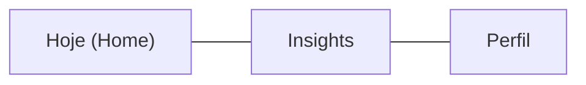

# MindLog UI/UX Redesign

## Design Principles

- **Night-friendly:** Warmer dark tones (less blue), reduced contrast, dimmer accents. The app will likely be used in bed at night.
- **Speed-first logging:** The most common action (log mood + a sentence) should take under 10 seconds with one hand.
- **Optional depth:** Detailed RPD fields (Emocao, Pensamento, Comportamento) are always available but never forced.
- **Visual mood language:** Color is the primary mood identifier, reinforced by labels. No emojis.

---

## 1. Navigation: 3-Tab Layout

Replace the current 2-tab bottom nav with 3 tabs. This separates concerns so the journal view isn't one giant scroll.



- **Hoje**: Quick mood entry + today's summary + streak counter + recent entries (last 3)
- **Insights**: Monthly mood charts (bar + doughnut) + mood calendar + search/filter + full history
- **Perfil**: Profile settings, export PDF, logout

Add a `BarChart` (from Lucide) icon for the Insights tab alongside the existing `BookOpen` and `User` icons.

Files changed: [src/components/BottomNav.jsx](src/components/BottomNav.jsx), [src/App.jsx](src/App.jsx)

---

## 2. Color Palette: Night Mode

Update CSS variables for warmer, lower-contrast dark tones that are easier on the eyes at night:

```css
:root {
  --bg-color: #0c0c0e;
  --card-bg: #161618;
  --card-bg-elevated: #1c1c1f;
  --text-primary: #e8e8eb;
  --text-secondary: #7a7a85;
  --accent: #6ee7a0;
  --accent-dim: rgba(110, 231, 160, 0.12);
  --border: #222225;
  --danger: #f87171;
}
```

Update mood colors to be slightly muted (less saturated, easier on eyes in dark):

```javascript
export const MOOD_COLORS = {
  happy:   '#86efac',
  neutral: '#d4d4a8',
  sad:     '#93c5fd',
  anxious: '#c4b5fd',
  angry:   '#fca5a5',
};
```

Files changed: [src/App.css](src/App.css), [src/constants/moods.js](src/constants/moods.js)

---

## 3. Mood Selector: Visual Tappable Buttons

Replace the `<select>` dropdown with a horizontal row of large, tappable mood buttons. Each shows:
- A filled color circle (the mood color, large)
- Short mood label below (e.g. "Feliz", "Triste")
- Selected button gets a brighter glow ring + slightly elevated background
- Unselected buttons show a muted/dimmed color with faint outline

This is the hero interaction of the app -- the first thing the user sees and taps.

Create new component: `src/components/MoodPicker.jsx`

Used inside `JournalForm` to replace the `<select>`.

---

## 4. Journal Form: Expandable Quick Entry

Restructure [src/components/JournalForm.jsx](src/components/JournalForm.jsx):

**Always visible:**
- MoodPicker (the color buttons from #3)
- Single textarea: "O que aconteceu?" (Situacao)
- Date chips (Hoje / Ontem / Outra Data)
- Submit button

**Behind "Adicionar detalhes" toggle:**
- Emocao textarea
- Pensamento textarea
- Comportamento textarea

These expand with a smooth slide animation. The user can fill any combination or none. None of them are required.

This reduces the form from ~5 scrollable cards to a compact single card.

---

## 5. Home View ("Hoje" Tab)

The new default view. Top-to-bottom layout:

1. **Greeting header**: Time-based greeting ("Boa noite, [name]") with today's date
2. **Streak counter**: "X dias consecutivos registrando" with a flame icon, displayed as a small pill badge
3. **Quick entry form**: The compact form from #4 (mood picker + situation + submit)
4. **Today's entries**: Show entries from today only (collapsed cards, see #8)

This view is optimized for the primary use case: open app, log mood, close app.

Files changed: [src/App.jsx](src/App.jsx), create `src/components/HomeView.jsx`

---

## 6. Monthly Mood Charts (Insights Tab)

This is the data/analytics view. Restructure [src/components/MoodChart.jsx](src/components/MoodChart.jsx) and add new chart types.

### 6a. Monthly mood bar chart (new)

A horizontal or vertical bar chart showing **mood count per week** within the selected month. Register the `BarElement` and `CategoryScale` chart.js elements. The X-axis shows "Sem 1", "Sem 2", "Sem 3", "Sem 4" and each bar is stacked by mood color.

### 6b. Monthly mood doughnut (existing, scoped)

Keep the current doughnut but filter it to show only the **currently selected month** (from the calendar's month picker), not all-time. Add a "total registros" number in the center of the doughnut.

### 6c. Mood trend line (new)

A line chart showing mood over the days of the month. Map moods to a numeric scale: angry=1, sad=2, anxious=3, neutral=4, happy=5. Plot one dot per day, connect with a smooth curve. This gives the user a visual sense of whether their month is trending up or down.

### 6d. Mood calendar (existing)

Keep [src/components/MoodCalendar.jsx](src/components/MoodCalendar.jsx) as-is (it already works well) but move it into the Insights tab.

Layout on Insights tab: month picker at top (shared between all charts), then swipeable/tabbed chart sections (Bar | Doughnut | Trend), then calendar below, then search + full entry history.

Create: `src/components/InsightsView.jsx`, `src/components/MoodBarChart.jsx`, `src/components/MoodTrendChart.jsx`

---

## 7. Entry Cards: Collapsible

Redesign [src/components/EntryList.jsx](src/components/EntryList.jsx):

**Collapsed state (default):**
- Left: mood color dot (filled circle in the mood's color)
- Center: first line of situation (truncated), date below in small text
- Right: chevron icon

**Expanded state (tap to toggle):**
- All 4 fields shown (Situacao, Emocao, Pensamento, Comportamento)
- Delete button only visible in expanded state
- Smooth height transition animation

This dramatically reduces vertical space and makes browsing history much faster.

---

## 8. Login Screen Polish

Update [src/components/LoginForm.jsx](src/components/LoginForm.jsx):

- Add a subtle tagline below "MINDLOG": "Seu diario de pensamentos"
- Animate the BrainCircuit logo border color cycling through mood colors on a slow loop
- Add a frosted glass effect to the auth card
- Ensure the form is centered vertically on the screen

---

## 9. Profile View Polish

Update [src/components/ProfileView.jsx](src/components/ProfileView.jsx):

- Move the PDF export button here (with an explanation: "Gere um relatorio para levar ao seu terapeuta")
- Add a mood summary stat: "Voce registrou X pensamentos este mes"
- Add an app version / "Sobre" section at the bottom

---

## 10. Micro-interactions and Transitions

- **View transitions**: Fade + slight slide when switching between tabs
- **Card press**: Subtle scale-down on press (`transform: scale(0.98)`)
- **Mood picker**: Selected mood button glows once gently (box-shadow pulse)
- **Toast entrance/exit**: Slide in from top, fade out
- **Form expand**: CSS `max-height` transition for the optional fields
- **Entry expand/collapse**: CSS `max-height` + opacity transition

All via CSS only, no animation library needed.

Files changed: [src/App.css](src/App.css)

---

## 11. Typography and Spacing

- Import Inter font properly via Google Fonts link in [index.html](index.html)
- Increase base line-height to 1.5 for readability
- Add more vertical breathing room between sections (24px instead of 20px)
- Use `font-variant-numeric: tabular-nums` for dates/numbers
- Reduce uppercase usage -- only for section labels, not for body text or buttons

---

## Summary of File Changes

- **New files:** `HomeView.jsx`, `InsightsView.jsx`, `MoodPicker.jsx`, `MoodBarChart.jsx`, `MoodTrendChart.jsx`
- **Major rewrites:** `App.jsx` (3-tab routing), `App.css` (full visual overhaul), `JournalForm.jsx` (expandable form), `EntryList.jsx` (collapsible cards), `MoodChart.jsx` (month-scoped doughnut), `BottomNav.jsx` (3 tabs), `Header.jsx` (greeting), `LoginForm.jsx` (polish)
- **Minor updates:** `moods.js` (softer colors, short labels), `ProfileView.jsx` (PDF export moved here), `SearchBar.jsx` (moved to Insights), `index.html` (font import)
- **No changes:** hooks, firebase config, Toast component
